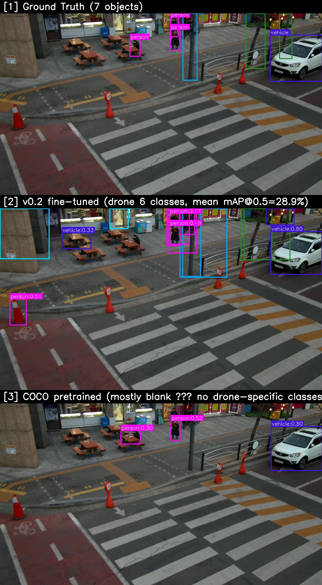

# aerial-perception

> 마이크로 항공기(MAV)를 위한 오픈소스 비전 인식 모델.
> NanoDet-Plus를 AI Hub 드론 항공 영상으로 전이학습한 6 클래스 객체 인식 모델 — ONNX·안드로이드 배포 지원.

<p align="center">
  
  <br/>
  <em>위: COCO 사전학습 모델 — 항공 영상에서 거의 인식 못 함.
  아래: 30 epoch 전이학습 후 — 다리·차량·시설물 모두 검출.</em>
</p>

## 프로젝트 상태

- v0.1 — 베이스라인 (청라 10m 단일 도메인, mAP@0.5 = 30.1%)
- **v0.2 (current)** — 17개 도시, 10m+15m 다중 도메인 학습. 일반화 성능 **+69% 향상**.
- 상용 배포용 아님. 프로토타입·연구·교육용으로 적합.
- 향후 계획: 멀티 모델 동물원 + LoRA 핫스왑 (아래 로드맵 참조).

### v0.2 핵심 변화

| | v0.1 | v0.2 |
|---|---|---|
| 학습 데이터 | 청라 10m (15,814 frames) | **17 cities × 10m+15m (70,503 frames)** |
| Train 어노테이션 | ~140k | **556,847** |
| Batch (effective) | 40 | **100** (batch 20/GPU × 5) |
| Epoch | 30 | 30 (best at epoch 15) |
| 청라10m mAP@0.5 | **30.1%** | 27.1% (-3pp, 청라 과적합 양보) |
| **4-도메인 평균 mAP@0.5** | 17.1% | **28.9%** (+69%) |

---

## 프로젝트 개요

| 항목 | 내용 |
|---|---|
| 도메인 | 드론 항공 영상 객체 인식 |
| 베이스 모델 | NanoDet-Plus-m-1.5x_416 (파라미터 7.79M) |
| 클래스 | `tree`, `structure`, `building`, `vehicle`, `bridge`, `person` |
| 학습 데이터 | AI Hub #183 — 청라 도시감시 10m 드론 영상 |
| Train / Val | 15,814 / 1,023 프레임 (4K JPG) |
| 산출물 | PyTorch (`.pth`, 31MB) · ONNX (11MB) |
| 라이선스 | Apache 2.0 |

모델 가중치는 본 레포에 포함되지 않으며 HuggingFace에서 다운로드:
[`harveykim/nanodet-plus-1.5x-aerial-6cls`](https://huggingface.co/harveykim/nanodet-plus-1.5x-aerial-6cls)

---

## 결과 — v0.2 다중 도메인 평가

### 4-도메인 일반화 매트릭스 (mAP@0.5)

| Val 도메인 | v0.1 (청라10m 전용) | **v0.2 (17도시 다중)** | 차이 |
|---|---:|---:|---:|
| 청라 10m (in-domain) | **30.1%** | 27.1% | -3.0 |
| 용인하남 15m (외삽-도시) | 7.3% | **23.6%** | **+16.3** |
| 드론택배 15m 인천_수원_하남 (외삽-도시) | 10.7% | **43.6%** | **+32.9** 🔥 |
| 농약살포 고성_경주 (외삽-농촌) | 20.4% | **21.3%** | +0.9 |
| **4-도메인 평균** | **17.1%** | **28.9%** | **+11.8pp (+69%)** |

→ v0.2가 모든 도메인에서 우세하거나 비등. 청라 in-domain만 v0.1이 약간 우세 (과적합 효과).

### 청라 10m 클래스별 (v0.1 vs v0.2, 같은 Val 1,023장)

| 클래스 | v0.1 | v0.2 | Δ |
|---|---:|---:|---:|
| **building** | 27.1% | **32.9%** | **+5.8pp** ✅ |
| **bridge** | 14.9% | **21.3%** | **+6.4pp** ✅ |
| vehicle | **61.0%** | 45.6% | -15.4pp |
| person | **41.4%** | 38.2% | -3.2pp |
| tree | **18.0%** | 11.8% | -6.2pp |
| structure | **18.1%** | 12.8% | -5.3pp |
| **mAP@0.5** | **30.1%** | 27.1% | -3.0pp |

v0.2는 building·bridge(고정형 객체)에서 도시 다양성 학습 효과를 보임. vehicle·person(이동 객체)은 청라 specific 패턴에 v0.1이 더 적응.

### 베이스라인 — COCO 사전학습과 비교 (v0.1 청라10m val 기준)

| 클래스 | 사전학습 (COCO 80) | v0.1 fine-tuned | v0.2 fine-tuned |
|---|---:|---:|---:|
| vehicle | 4.2% | **61.0%** | 45.6% |
| person | 1.3% | **41.4%** | 38.2% |
| building | — | 27.1% | **32.9%** |
| structure | — | 18.1% | 12.8% |
| tree | — | 18.0% | 11.8% |
| bridge | — | 14.9% | **21.3%** |

COCO 사전학습 모델은 tree·structure·bridge 같은 클래스 자체가 없음.
전이학습으로 0% → 신규 학습. vehicle·person은 폭발적 향상.

---

## 시각적 비교

### v0.1 vs v0.2 — 같은 청라10m val 프레임 (3패널: GT / v0.1 / v0.2)

<p align="center">
  
  <br/>
  <em>[1] GT (정답 4박스) · [2] v0.1 (청라 전용, 4 검출) · [3] v0.2 (17도시 다중, 7 검출).
  v0.2가 v0.1이 놓친 작은 객체 추가 검출.</em>
</p>

<p align="center">
  
  <br/>
  <em>[1] GT (7박스) · [2] v0.1 (7 검출, 정확 매칭) · [3] v0.2 (10 검출, 추가 객체 발견).
  v0.2가 더 적극적으로 검출. precision-recall trade-off.</em>
</p>

<p align="center">
  
  <br/>
  <em>[1] GT (7박스) · [2] v0.1 (20 검출, false positive 많음) · [3] v0.2 (15 검출, 비교적 보수적).
  같은 도메인(청라10m)이라 v0.1이 over-detect 경향. v0.2는 일반화 학습으로 더 신중.</em>
</p>

### 6 클래스 모두 검출하는 데모 (v0.1 기준 — 추후 v0.2로 갱신 예정)

<p align="center">
  
  <br/>
  <em>한 프레임에서 6개 클래스 모두 검출 (training sample).
  도시 도로 장면에서 나무·시설물·건물·차량·다리·사람 동시 인식.</em>
</p>

### 학습 전 vs 학습 후

<p align="center">
  
  <br/>
  <em>위: 사전학습 모델 — 좁쌀만한 사람을 거의 못 잡음.
  아래: 전이학습 모델 — 작은 사람과 다수의 시설물 새로 검출.</em>
</p>

### 3 패널 종합 비교 — Ground Truth / 전이학습 / 사전학습

<p align="center">
  
  <br/>
  <em>[1] Ground Truth (사람이 단 정답) · [2] 전이학습 모델 · [3] 사전학습 (사실상 백지).</em>
</p>

### 박스 색상 범례

| 클래스 | 색상 |
|---|---|
| tree | 녹색 (forest green) |
| structure | 주황 (orange) |
| building | 청색 (steel blue) |
| vehicle | 적색 (crimson) |
| bridge | 황색 (gold) |
| person | 분홍 (magenta) |

---

## 빠른 시작

### 1. 환경 설치

```bash
git clone git@github.com:DeepMav/aerial-perception.git
cd aerial-perception
pip install -r requirements.txt
```

### 2. 모델 가중치 다운로드 (HuggingFace)

```bash
# huggingface-cli 사용
pip install huggingface_hub
huggingface-cli download harveykim/nanodet-plus-1.5x-aerial-6cls \
    drone_nanodet_416.onnx --local-dir ./weights/
```

### 3. ONNX 추론 (예정)

```bash
python scripts/infer_onnx.py \
    --model ./weights/drone_nanodet_416.onnx \
    --image path/to/aerial.jpg \
    --score-threshold 0.3
```

### 안드로이드 배포

1. ONNX → NCNN (`.param` + `.bin`) 변환
2. NanoDet 공식 [Android NCNN 데모](https://github.com/RangiLyu/nanodet/tree/main/demo_android_ncnn) 활용
3. 클래스명을 본 프로젝트의 6 클래스로 교체
4. 예상 추론 속도: 8–25ms (Snapdragon 8 Gen 1+)

---

## 학습 재현

학습을 직접 재현하려면 AI Hub에서 데이터셋 #183을 다운로드 후
경로를 본인 환경에 맞게 수정 필요:

```bash
# 1. AI Hub 데이터셋 다운로드 (별도 신청 후 aihubshell)
#    https://www.aihub.or.kr/aihubdata/data/view.do?dataSetSn=183

# 2. 라벨 zip 압축 해제, JSON → COCO 변환
python scripts/make_coco_full.py
# (스크립트 상단 경로 변수를 본인 환경에 맞게 수정)

# 3. NanoDet 학습 (NanoDet 별도 설치 필요)
python /path/to/nanodet/tools/train.py models/nanodet_plus_1.5x_416/config/drone_full.yml

# 4. 평가·시각화
python scripts/eval_compare.py
python scripts/visualize.py
```

`scripts/` 내 모든 파일의 경로 변수는 본인 환경에 맞게 수정해야 합니다.

---

## 로드맵

```
v0.1          NanoDet-Plus 청라10m 베이스라인 (mAP 30%, 단일 도메인)
v0.2 (현재)    17 도시 × 10m+15m 다중 도메인 학습 (4-도메인 평균 mAP 29%)
                 - 일반화 +69% 향상 (도시감시·드론택배 시나리오)
                 - 농촌 도메인은 별도 학습 필요
v0.3          전체 #183 데이터 + 균형 sampling (Exp J)
                 - 농약살포·드론택배 통합 → 농촌 도메인 보강
                 - 클래스 불균형 hard cap sampling
                 - 예상 mAP 38~45%
v0.4          입력 해상도 640 + SAHI 추론 (Exp B+D)
                 - 작은 객체 검출 강화 (tree, structure, 15m 차량/사람)
                 - 예상 mAP 50%+
v0.5          YOLOv8 / RT-DETR 베이스라인 비교 + 리더보드
v0.6          LoRA 핫스왑 엔진
                 - 도메인 어댑터: 도시 / 농촌 / 배송 / 산악
                 - 런타임 모델 전환 (1초 미만)
v0.7          모바일 배포 (Android NCNN/TFLite, Jetson)
v1.0          정식 릴리즈, 논문, HuggingFace Spaces 데모
```

### LoRA 핫스왑이 왜 필요한가

도메인마다 완전 학습 모델을 따로 만들면 약 30MB × N이 필요합니다.
LoRA 어댑터를 사용하면:

- 2–5MB 어댑터 per 도메인 (cheongna-urban, dusting-rural, delivery, slam-mountain 등)
- 1초 미만에 런타임 교체
- 베이스 모델은 PyTorch / ONNX 하나만 로드

드론 한 대로 도시·농촌·산악 등 다양한 환경 대응 가능.

---

## 한계 및 주의사항 (v0.2 기준)

- **농촌·시골 도메인 약함** — 농약살포 데이터를 학습에 포함하지 않아 농경지에서 21.3% mAP. 향후 v0.3에서 추가 예정.
- **15m 이상 고도의 차량/사람** — 416×416 입력으로 다운샘플 시 너무 작아져 검출 실패 (vehicle 0~20% at 15m).
- **야간/일출/일몰** — 학습 데이터 부재. 추정 mAP <10%.
- **입력 해상도 416×416** — 4K 원본을 416으로 줄이면서 작은 객체 정보 손실.
  실서비스에는 SAHI(슬라이싱 추론) 또는 입력 640×640 학습(Exp B) 권장.
- **Epoch 15 plateau** — Cosine annealing 후반에도 추가 향상 없음. 데이터 다양성 확대가 더 효과적.
- **상용 비행에 부적합** — 자율 회피·구조·자동 항법 등은 mAP ≥ 50% 필요.

### 적합한 용도

| 용도 | 가능? |
|---|---|
| 데모·시연 (도시, 낮, 5~10m) | ✅ |
| AI 라벨링 자동화 보조 | ✅ (사람 검수 병행) |
| 교육·연구 baseline | ✅ |
| 상용 자율 비행 | ❌ |
| 농업 모니터링 | ❌ (도메인 미학습) |
| 야간 작업 | ❌ (데이터 부재) |

---

## 프로젝트 구조

```
aerial-perception/
├── models/
│   └── nanodet_plus_1.5x_416/
│       ├── config/drone_full.yml         # 학습 설정
│       └── README.md                      # 모델 카드 (HuggingFace 링크)
├── scripts/                                # 데이터 변환, 학습, 평가
│   ├── make_coco_full.py
│   ├── eval_compare.py
│   ├── visualize.py
│   ├── visualize_before_after.py
│   └── find_all_classes.py
├── viz/                                    # 시각화 결과
└── docs/                                   # 추가 문서
```

---

## 감사의 글

- 베이스 모델: [NanoDet-Plus](https://github.com/RangiLyu/nanodet) — [@RangiLyu](https://github.com/RangiLyu) (Apache 2.0)
- 데이터셋: [AI Hub #183 드론 이동체 인지 영상](https://www.aihub.or.kr/aihubdata/data/view.do?dataSetSn=183)
  연구 목적 사용. 원본 데이터는 본 레포에 재배포되지 않음.
- 조직: [DeepMav](https://github.com/DeepMav)

## 라이선스

본 레포는 별도 라이선스를 부여하지 않습니다 (All Rights Reserved).
연구·교육·상용 활용을 원하시면 별도 협의 바랍니다.

다음은 별도 라이선스 적용:

- **NanoDet 베이스 코드** (NanoDet 원본 구조 등):
  원작자 [@RangiLyu](https://github.com/RangiLyu)의 Apache 2.0 라이선스 유지.
- **모델 가중치 (HuggingFace)**:
  [`harveykim/nanodet-plus-1.5x-aerial-6cls`](https://huggingface.co/harveykim/nanodet-plus-1.5x-aerial-6cls)는
  **CC BY-NC 4.0** 라이선스 (비상용·출처 표시).
