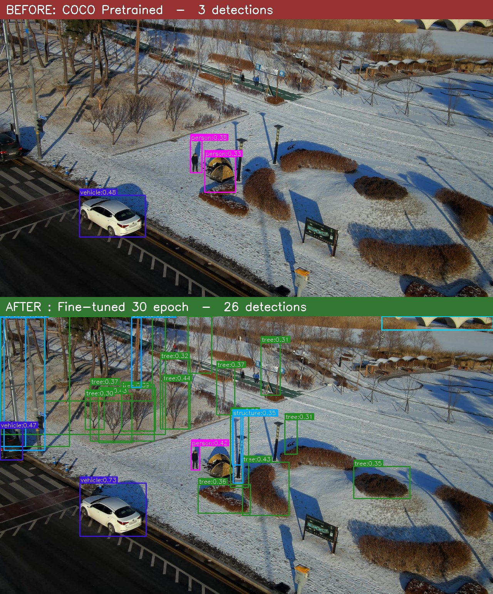
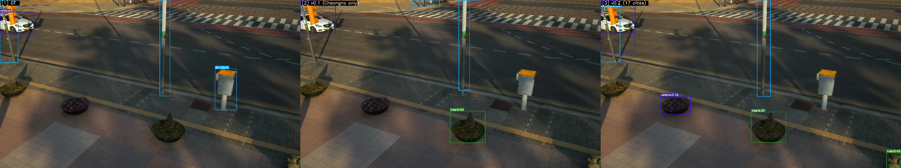
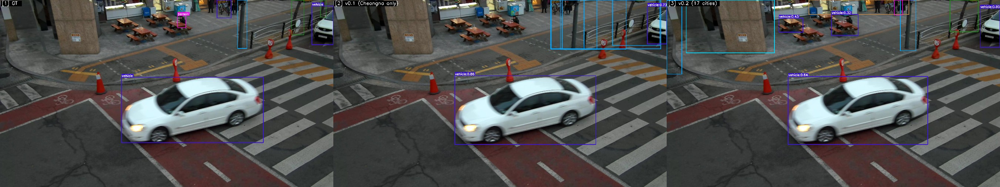
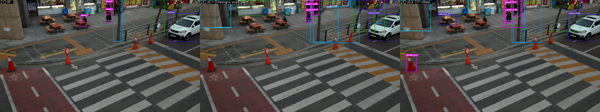
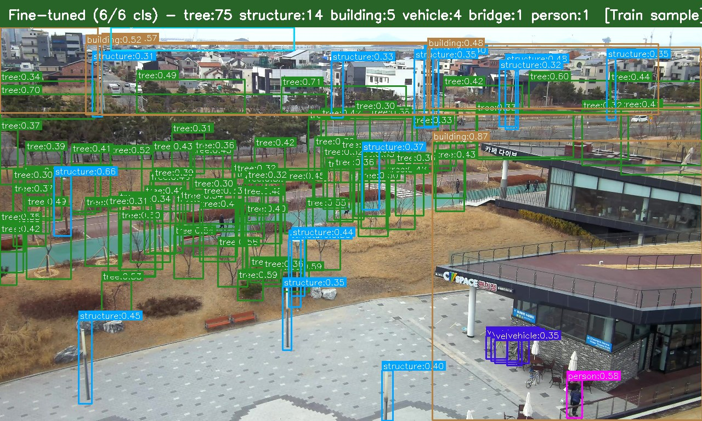
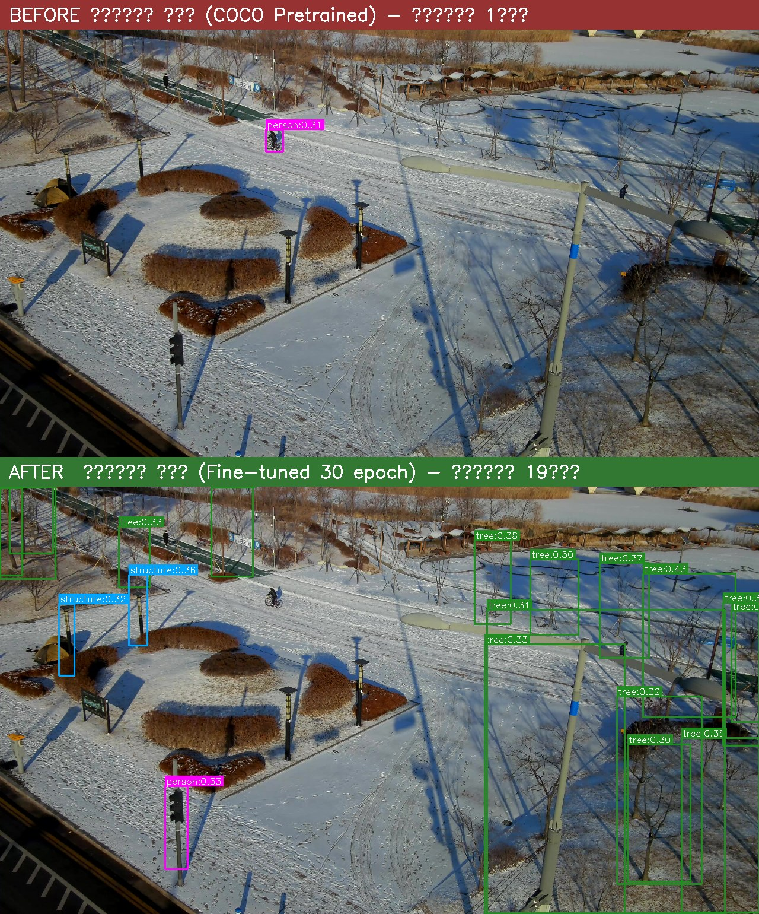
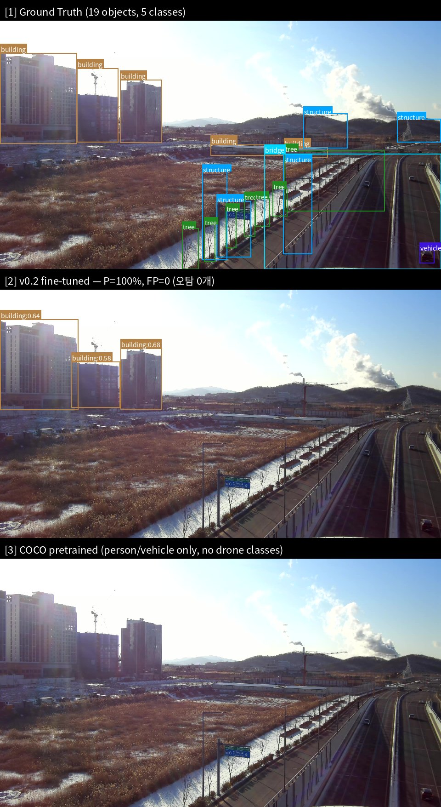
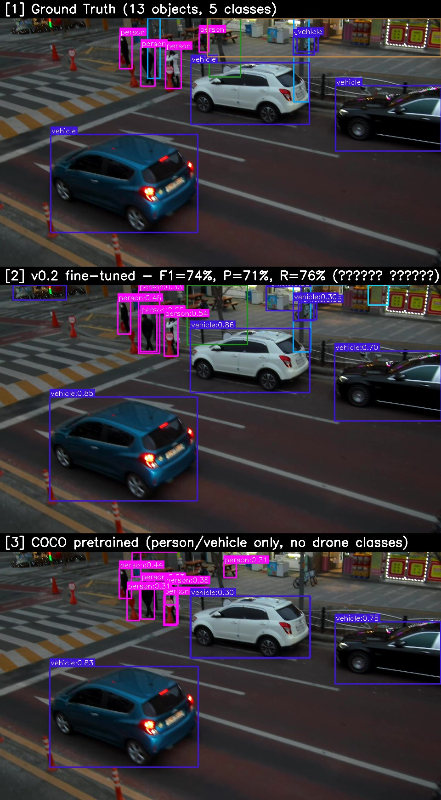

# aerial-perception

> 마이크로 항공기(MAV)를 위한 오픈소스 비전 인식 모델.
> NanoDet-Plus를 AI Hub 드론 항공 영상으로 전이학습한 6 클래스 객체 인식 모델 — ONNX·안드로이드 배포 지원.

<p align="center">
  
  <br/>
  <em>위: COCO 사전학습 모델 — 항공 영상에서 거의 인식 못 함.
  아래: 30 epoch 전이학습 후 — 다리·차량·시설물 모두 검출.</em>
</p>

## 프로젝트 상태

- v0.1 — 베이스라인 (청라 10m 단일 도메인, 4-도메인 평균 17.1%)
- v0.2 — 17개 도시, 10m+15m 다중 도메인 학습 (4-도메인 평균 28.9%, +69%)
- v0.3 (Exp J) — 전체 4도메인 + hard-cap 샘플링 (28.5%, 사실상 정체)
- v0.4 — 고도층화 재샘플링 (29.2%, 소폭 개선)
- **v0.5 (Exp B, current)** — 입력 416→640. **4-도메인 평균 35.4%** (v0.2 대비 +22%), 4개 도메인 전부 역대 최고.
- v0.6 (보류) — 타일 파인튜닝 + test-time SAHI 시도. **음성 결과**(SAHI 오탐 폭증으로 v0.5 전체추론을 못 넘음) → 운용은 v0.5 유지. 상세는 로드맵 참조.
- **v0.7 (운용개선)** — 나무 오탐 줄이기. **재학습 없이** 나무 NMS 중복제거 + 클래스별 threshold로 **4-도메인 FPPI 절반 이하**(예: 청라 8.4→3.7), mAP 불변. 가중치는 v0.5 그대로.
- **v0.8 (실험)** — 나무 라벨 완성 후 재학습(근본 원인 공략). **진단**: 나무 라벨이 고도별 이중모드(저고도 촘촘, 15m↑ 사실상 0) → v0.5는 15m 나무에 장님(0.0검출/img). **방법**: open-vocab 검출기(OWLv2) + v0.5 구조물-veto로 15m 미라벨 나무를 자동 완성(나무 라벨 **+37%, 77.5k→106k**), exp_b warm-start 10ep 재학습(전체 33k). **결과(정직)**: 15m 나무 검출 recall **1.1%→14.3%**(자동 생성 기준 라벨 대비, 13×), 라벨 도메인 나무 FP 감소(청라 tree FPPI 2.14→1.21), **4-도메인 헤드라인 mAP 동률**(≈26.6, 동일 운용점). ⚠️ 15m 향상은 자동 라벨(≈85% 정밀, 사람 GT 아님) 기준이며 평가셋 15m 나무 라벨 희소로 헤드라인엔 미반영. **가중치는 v0.5 유지**(본배포 보류, 사람 라벨 검증이 다음 단계).
  - **🔬 사람 GT 검증 (정직한 후속, 부분 표본)** — 평가셋 15m 나무를 사람이 완전 교정해(현재 12장, 나무 483개) 재측정한 결과, **자동 라벨 기준 14.3%는 자기확증 착시로 확인**. 사람 GT 대비 15m 나무 recall은 운용점 **0.4%**, threshold를 0까지 풀어도 천장 **6.0%**(이때 FPPI 8.3 — 사용 불가), 개별 나무를 군락 단위로 12배 뭉쳐 재채점해도 FP 통제점에서 최대 **7.3%**. 비교군 v0.5는 모든 조건에서 **0.0%**(12장 전체 나무검출 1개 = 완전 장님). → v0.8의 **학습 메커니즘은 작동**(0%→검출)하나, 14.3%는 OWLv2 자동 라벨(모델이 학습한 것과 동형)에 대고 잰 값이라 부풀려졌고 **배포 가능한 15m 나무 성능에는 크게 못 미침**. **결론: 가중치 v0.5 유지 확정.** (n=12는 부분 표본 — 잔여 28장 교정 예정이나 0%·6%·7% 세 측정이 일관됨.)
- 상용 배포용 아님. 프로토타입·연구·교육용으로 적합.
- ✅ HuggingFace 호스팅 가중치는 **v0.5(입력 640)** 기준 — `.pth` + `drone_nanodet_640.onnx`.

### 버전별 진화 — 4-도메인 평균 mAP@0.5 (v0.1 → v0.5)

| 버전 | 청라10m | 용인하남15m | 택배15m | 농약 | **4-도메인 평균** | 핵심 변경 |
|---|---:|---:|---:|---:|---:|---|
| v0.1 | **30.1** | 7.3 | 10.7 | 20.4 | 17.1 | 청라 단일(과적합) |
| v0.2 | 27.1 | 23.6 | 43.6 | 21.3 | 28.9 `+11.8` | 17도시 다중도메인 |
| v0.3 (Exp J) | 26.6 | 19.2 | 33.5 | 34.8 | 28.5 `-0.4` | 4도메인+hard-cap |
| v0.4 | 24.4 | 19.5 | 36.5 | 36.4 | 29.2 `+0.7` | 고도층화 재샘플링 |
| **v0.5 (Exp B)** | **29.3** | **25.1** | **43.6** | **43.6** | **35.4** `+6.2` | **입력 416→640** |

→ v0.2 이후 두 번의 데이터 실험(v0.3·v0.4)은 도메인 간 맞교환으로 **평균은 거의 제자리**였고, 입력 해상도를 640으로 올린 **v0.5에서 비로소 벽을 넘어** 4개 도메인 전부 역대 최고를 기록. (단 v0.5도 15m 고도 차량은 여전히 미해결 — 로드맵의 타일/SAHI 추론 대상.)

### v0.1 → v0.2 학습 변화 (참고)

| | v0.1 | v0.2 |
|---|---|---|
| 학습 데이터 | 청라 10m (15,814 frames) | **17 cities × 10m+15m (70,503 frames)** |
| Train 어노테이션 | ~140k | **556,847** |
| Batch (effective) | 40 | **100** (batch 20/GPU × 5) |
| Epoch | 30 | 30 (best at epoch 15) |
| 청라10m mAP@0.5 | **30.1%** | 27.1% (-3pp, 청라 과적합 양보) |

---

## 프로젝트 개요

| 항목 | 내용 |
|---|---|
| 도메인 | 드론 항공 영상 객체 인식 |
| 베이스 모델 | NanoDet-Plus-m-1.5x_416 (파라미터 7.79M) |
| 클래스 | `tree`, `structure`, `building`, `vehicle`, `bridge`, `person` |
| 학습 데이터 | AI Hub #183 — 청라 도시감시 10m 드론 영상 |
| Train / Val | 15,814 / 1,023 프레임 (4K JPG) |
| 산출물 | PyTorch (`.pth`, 31MB) · ONNX (11MB) |
| 라이선스 | Apache 2.0 |

모델 가중치는 본 레포에 포함되지 않으며 HuggingFace에서 다운로드:
[`harveykim/nanodet-plus-1.5x-aerial-6cls`](https://huggingface.co/harveykim/nanodet-plus-1.5x-aerial-6cls)

---

## 결과 — 다중 도메인 평가

### 4-도메인 일반화 매트릭스 (mAP@0.5, τ=0.3, IoU≥0.5)

| Val 도메인 | v0.1 | v0.2 | v0.3 | v0.4 | **v0.5 (current)** | v0.2→v0.5 |
|---|---:|---:|---:|---:|---:|---:|
| 청라 10m (in-domain) | **30.1** | 27.1 | 26.6 | 24.4 | **29.3** | +2.2 |
| 용인하남 15m (외삽-도시) | 7.3 | 23.6 | 19.2 | 19.5 | **25.1** | +1.5 |
| 드론택배 15m (외삽-도시 시나리오) | 10.7 | 43.6 | 33.5 | 36.5 | **43.6** | +0.0 |
| 농약살포 (외삽-농촌) | 20.4 | 21.3 | 34.8 | 36.4 | **43.6** | **+22.3** 🔥 |
| **4-도메인 평균** | 17.1 | 28.9 | 28.5 | 29.2 | **35.4** | **+6.5pp (+22%)** |

→ **v0.5(입력 640)가 4개 도메인 전부에서 역대 최고이거나 동률**. 특히 농촌(농약살포)이 v0.2 대비 2배 이상. v0.3·v0.4(데이터 실험)는 도메인 간 맞교환으로 평균이 정체했으나, v0.5의 해상도 상향이 모든 도메인을 동반 상승시킴. (모든 평가는 동일 파이프라인 — v0.2 재측정값이 기존 발표치와 정확히 일치함을 확인.)

> ✅ **현재 HuggingFace 호스팅 가중치는 v0.5(입력 640).** 모든 수치는 동일 평가 파이프라인 측정값이며, v0.2 재측정이 기존 발표치와 정확히 일치함을 확인했습니다.

### 청라 10m 클래스별 (v0.1 vs v0.2, 같은 Val 1,023장)

| 클래스 | v0.1 | v0.2 | Δ |
|---|---:|---:|---:|
| **building** | 27.1% | **32.9%** | **+5.8pp** ✅ |
| **bridge** | 14.9% | **21.3%** | **+6.4pp** ✅ |
| vehicle | **61.0%** | 45.6% | -15.4pp |
| person | **41.4%** | 38.2% | -3.2pp |
| tree | **18.0%** | 11.8% | -6.2pp |
| structure | **18.1%** | 12.8% | -5.3pp |
| **mAP@0.5** | **30.1%** | 27.1% | -3.0pp |

v0.2는 building·bridge(고정형 객체)에서 도시 다양성 학습 효과를 보임. vehicle·person(이동 객체)은 청라 specific 패턴에 v0.1이 더 적응.

### 베이스라인 — COCO 사전학습과 비교 (v0.1 청라10m val 기준)

| 클래스 | 사전학습 (COCO 80) | v0.1 fine-tuned | v0.2 fine-tuned |
|---|---:|---:|---:|
| vehicle | 4.2% | **61.0%** | 45.6% |
| person | 1.3% | **41.4%** | 38.2% |
| building | — | 27.1% | **32.9%** |
| structure | — | 18.1% | 12.8% |
| tree | — | 18.0% | 11.8% |
| bridge | — | 14.9% | **21.3%** |

COCO 사전학습 모델은 tree·structure·bridge 같은 클래스 자체가 없음.
전이학습으로 0% → 신규 학습. vehicle·person은 폭발적 향상.

---

## 시각적 비교

### v0.1 vs v0.2 — 같은 청라10m val 프레임 (3패널: GT / v0.1 / v0.2)

<p align="center">
  
  <br/>
  <em>[1] GT (정답 4박스) · [2] v0.1 (청라 전용, 4 검출) · [3] v0.2 (17도시 다중, 7 검출).
  v0.2가 v0.1이 놓친 작은 객체 추가 검출.</em>
</p>

<p align="center">
  
  <br/>
  <em>[1] GT (7박스) · [2] v0.1 (7 검출, 정확 매칭) · [3] v0.2 (10 검출, 추가 객체 발견).
  v0.2가 더 적극적으로 검출. precision-recall trade-off.</em>
</p>

<p align="center">
  
  <br/>
  <em>[1] GT (7박스) · [2] v0.1 (20 검출, false positive 많음) · [3] v0.2 (15 검출, 비교적 보수적).
  같은 도메인(청라10m)이라 v0.1이 over-detect 경향. v0.2는 일반화 학습으로 더 신중.</em>
</p>

### 6 클래스 모두 검출하는 데모 (v0.1 기준 — 추후 v0.2로 갱신 예정)

<p align="center">
  
  <br/>
  <em>한 프레임에서 6개 클래스 모두 검출 (training sample).
  도시 도로 장면에서 나무·시설물·건물·차량·다리·사람 동시 인식.</em>
</p>

### 학습 전 vs 학습 후

<p align="center">
  
  <br/>
  <em>위: 사전학습 모델 — 좁쌀만한 사람을 거의 못 잡음.
  아래: 전이학습 모델 — 작은 사람과 다수의 시설물 새로 검출.</em>
</p>

### 3 패널 종합 비교 — Ground Truth / v0.2 전이학습 / COCO 사전학습

오탐 분석(아래 섹션)으로 선정된 **깨끗한 검출 사례**:

<p align="center">
  
  <br/>
  <em>오탐 0개 사례 (id 213) — [1] GT · [2] v0.2 (Precision 100%, FP=0, "잡은 건 다 맞음") · [3] COCO 사전학습.
  v0.2는 보수적이라 recall 15%지만 false positive가 전혀 없음.</em>
</p>

<p align="center">
  
  <br/>
  <em>최고 균형 사례 (id 924) — [1] GT (13 objects, 5 classes) · [2] v0.2 (F1=74%, P=71% R=76%, TP 10 / FP 4) · [3] COCO 사전학습.
  v0.2가 GT 13개 중 10개 정확 검출, 4개 오탐만 발생.</em>
</p>

### 오탐(False Positive) 지표 — v0.2 청라10m val 전체 분석

| 지표 | 값 | 해석 |
|---|---:|---|
| Precision | **32.9%** | 검출 3개 중 1개만 정답 |
| Recall | 21.0% | GT 5개 중 1개만 찾음 |
| F1 | 25.6% | 균형 점수 |
| **FPPI** (이미지당 FP) | **7.87** | 한 이미지당 평균 ~8개 오탐 |
| Total TP / FP / FN | 3,939 / 8,049 / 14,812 | 오탐이 정탐보다 2배 많음 |

**오탐 클래스 분포 — tree가 압도적**:

| Class | FP 개수 | 비율 |
|---|---:|---:|
| **tree** | **4,821** | **59.9%** 🔥 |
| structure | 1,336 | 16.6% |
| building | 569 | 7.1% |
| person | 518 | 6.4% |
| vehicle | 468 | 5.8% |
| bridge | 337 | 4.2% |

→ **모든 오탐의 60%가 tree** — 잎사귀·관목·그늘진 영역을 tree로 오인. 다음 학습(v0.3)에서 핵심 개선 대상.

**오탐 지표의 위치** (혼동 방지):
- mAP@0.5에 **간접적으로** 반영됨 (PR 곡선 면적 → Precision 낮으면 AP 낮음)
- COCO eval은 **FP를 별도 카운트로 보고하지 않음**
- 위 표의 P/R/F1/FPPI는 본 분석에서 **직접 계산** (score≥0.3, IoU≥0.5 기준)

### 박스 색상 범례

| 클래스 | 색상 |
|---|---|
| tree | 녹색 (forest green) |
| structure | 주황 (orange) |
| building | 청색 (steel blue) |
| vehicle | 적색 (crimson) |
| bridge | 황색 (gold) |
| person | 분홍 (magenta) |

---

## 빠른 시작

### 1. 환경 설치

```bash
git clone git@github.com:DeepMav/aerial-perception.git
cd aerial-perception
pip install -r requirements.txt
```

### 2. 모델 가중치 다운로드 (HuggingFace)

```bash
# huggingface-cli 사용
pip install huggingface_hub
huggingface-cli download harveykim/nanodet-plus-1.5x-aerial-6cls \
    drone_nanodet_640.onnx --local-dir ./weights/
```

### 3. ONNX 추론 (예정)

```bash
python scripts/infer_onnx.py \
    --model ./weights/drone_nanodet_640.onnx \
    --image path/to/aerial.jpg \
    --score-threshold 0.3
```

### 안드로이드 배포

1. ONNX → NCNN (`.param` + `.bin`) 변환
2. NanoDet 공식 [Android NCNN 데모](https://github.com/RangiLyu/nanodet/tree/main/demo_android_ncnn) 활용
3. 클래스명을 본 프로젝트의 6 클래스로 교체
4. 예상 추론 속도: 8–25ms (Snapdragon 8 Gen 1+)

---

## 학습 재현

학습을 직접 재현하려면 AI Hub에서 데이터셋 #183을 다운로드 후
경로를 본인 환경에 맞게 수정 필요:

```bash
# 1. AI Hub 데이터셋 다운로드 (별도 신청 후 aihubshell)
#    https://www.aihub.or.kr/aihubdata/data/view.do?dataSetSn=183

# 2. 라벨 zip 압축 해제, JSON → COCO 변환
python scripts/make_coco_full.py
# (스크립트 상단 경로 변수를 본인 환경에 맞게 수정)

# 3. NanoDet 학습 (NanoDet 별도 설치 필요)
python /path/to/nanodet/tools/train.py models/nanodet_plus_1.5x_416/config/drone_full.yml

# 4. 평가·시각화
python scripts/eval_compare.py
python scripts/visualize.py
```

`scripts/` 내 모든 파일의 경로 변수는 본인 환경에 맞게 수정해야 합니다.

---

## 로드맵

```
[완료]
v0.1          NanoDet-Plus 청라10m 베이스라인 (4-도메인 평균 17.1%, 단일 도메인 과적합)
v0.2          17 도시 × 10m+15m 다중 도메인 학습 (4-도메인 평균 28.9%, +69%)
v0.3 (Exp J)  전체 #183 4도메인 + hard-cap 샘플링 (28.5%)
                 - 농약 +13.5pp 끌어올렸으나 택배·용인하남 양보 → 평균 정체
v0.4          고도층화 재샘플링 (29.2%)
                 - 실제 고도 기반 quota. 도메인 맞교환, 소폭 개선
v0.5 (Exp B)  입력 해상도 416 → 640 (4-도메인 평균 35.4%, current)
                 - 4개 도메인 전부 역대 최고. person 작은객체 recall 급등
                 - 단, 15m 고도 차량은 여전히 미해결(해상도만으론 부족)
v0.6 (보류)   타일 파인튜닝 + test-time SAHI — 음성 결과, 운용은 v0.5 유지
                 - 1024 타일로 v0.5 파인튜닝 후 SAHI 추론. vehicle recall은 회복했으나
                   building 오탐 폭증(FPPI ~24)으로 종합 mAP가 v0.5 전체추론(0.417)을 못 넘음
                 - px 게이팅은 vehicle과 structure 박스크기 분포가 겹쳐 분리 실패
                   (오탐 줄이면 차량도 동반 사망: vehicle recall 0.45→0.09)
                 - 결론: test-time SAHI 단독으론 부족. train-time 타일링 + score 캘리브레이션
                   필요(ROI 불확실, v0.5가 이미 더 나음)
v0.7 (운용개선) tree 오탐 줄이기 — 재학습 없이 FPPI 절반 이하, mAP 불변
                 - 나무 전용 NMS 중복제거(IoU 0.3) + 클래스별 score threshold
                 - 4-도메인 전체 FPPI: 청라 8.4→3.7, 택배 7.8→2.6, 농약 5.0→2.2, 용인하남 9.6→3.2
                 - 나무 AP 변화 <1pp(=mAP 불변). 청라 나무 FPPI 4.4→2.1
                 - 진단: 나무 FP = 위치오차/중복 + 그림자 환각 + 학습셋 라벨 희소(16.5%만 라벨)의
                   복합. negative-mining 파인튜닝은 라벨 희소와 충돌해 보류, 무료 레버로 운용점 해결.
                 - 근본 해결(미라벨 나무 재라벨 후 재학습)은 향후 과제
v0.8 (실험)   나무 라벨 완성 후 재학습 — 15m 미라벨 나무를 OWLv2+v0.5 구조물-veto로 자동완성(+37%, 77.5k→106k)
                 - 15m 나무 recall 1.1%→14.3%(자동 생성 라벨 기준, 13×), 나무 FP 감소(청라 tree FPPI 2.14→1.21)
                 - 4-도메인 헤드라인 mAP 동률. 가중치는 v0.5 유지 — 자동 라벨 기준이라 사람 GT 검증이 다음 단계
                 - [6/9 사람 GT 검증] 14.3%는 자기확증 착시로 확인. 사람 GT(12장,나무483) 대비
                   운용점 0.4%·threshold 천장 6.0%(FPPI8.3)·군락병합 최대 7.3%. v0.5는 전 조건 0.0%.
                   메커니즘은 작동하나 배포 성능 미달 → 가중치 v0.5 유지 확정

[예정]
v0.9          YOLOv8 / RT-DETR 베이스라인 비교 + 리더보드
v1.0          LoRA 핫스왑 엔진
                 - 도메인 어댑터: 도시 / 농촌 / 배송 / 산악
                 - 런타임 모델 전환 (1초 미만)
v1.1          모바일 배포(Android NCNN/TFLite, Jetson) + 정식 릴리즈·논문
```

### LoRA 핫스왑이 왜 필요한가

도메인마다 완전 학습 모델을 따로 만들면 약 30MB × N이 필요합니다.
LoRA 어댑터를 사용하면:

- 2–5MB 어댑터 per 도메인 (cheongna-urban, dusting-rural, delivery, slam-mountain 등)
- 1초 미만에 런타임 교체
- 베이스 모델은 PyTorch / ONNX 하나만 로드

드론 한 대로 도시·농촌·산악 등 다양한 환경 대응 가능.

---

## 한계 및 주의사항 (v0.5 기준)

- **농촌·시골 도메인** — v0.2까지 약점(21.3%)이었으나 농약살포 학습 + 640으로 **v0.5에서 43.6%로 개선**. 도시 대비 데이터량은 여전히 적음.
- **15m 이상 고도의 차량** — **v0.5(640)으로도 검출 실패**(vehicle@15m ~0%). 해상도 상향만으론 한계. v0.6에서 타일/SAHI 추론을 시도했으나 test-time SAHI 단독은 오탐 폭증으로 부족 → train-time 타일링 필요(로드맵 v0.6 참조).
- **tree 오탐** — 잎사귀·관목·그림자를 나무로 오인. **v0.7 운용개선(나무 NMS 중복제거 + threshold)으로 4-도메인 FPPI를 절반 이하로 감축**(mAP 불변). 단 근본원인(학습셋 나무 라벨 16.5%만 — 미라벨 나무 다수로 인한 모순 신호)은 남아 있어, 라벨 정화 후 재학습이 향후 과제.
- **야간/일출/일몰** — 학습 데이터 부재. 추정 mAP <10%.
- **640 입력의 비용** — 416 대비 연산·메모리 ~2.4배. 8GB GPU에선 batch 절반(effective 50). 모바일 배포 시 추론 지연 증가 고려.
- **상용 비행에 부적합** — 자율 회피·구조·자동 항법 등은 mAP ≥ 50% 필요.

### 적합한 용도

| 용도 | 가능? |
|---|---|
| 데모·시연 (도시, 낮, 5~10m) | ✅ |
| AI 라벨링 자동화 보조 | ✅ (사람 검수 병행) |
| 교육·연구 baseline | ✅ |
| 상용 자율 비행 | ❌ |
| 농업 모니터링 | ❌ (도메인 미학습) |
| 야간 작업 | ❌ (데이터 부재) |

---

## 프로젝트 구조

```
aerial-perception/
├── models/
│   └── nanodet_plus_1.5x_416/
│       ├── config/drone_full.yml         # 학습 설정
│       └── README.md                      # 모델 카드 (HuggingFace 링크)
├── scripts/                                # 데이터 변환, 학습, 평가
│   ├── make_coco_full.py
│   ├── eval_compare.py
│   ├── visualize.py
│   ├── visualize_before_after.py
│   └── find_all_classes.py
├── viz/                                    # 시각화 결과
└── docs/                                   # 추가 문서
```

---

## 감사의 글

- 베이스 모델: [NanoDet-Plus](https://github.com/RangiLyu/nanodet) — [@RangiLyu](https://github.com/RangiLyu) (Apache 2.0)
- 데이터셋: [AI Hub #183 드론 이동체 인지 영상](https://www.aihub.or.kr/aihubdata/data/view.do?dataSetSn=183)
  연구 목적 사용. 원본 데이터는 본 레포에 재배포되지 않음.
- 조직: [DeepMav](https://github.com/DeepMav)

## 라이선스

본 레포는 별도 라이선스를 부여하지 않습니다 (All Rights Reserved).
연구·교육·상용 활용을 원하시면 별도 협의 바랍니다.

다음은 별도 라이선스 적용:

- **NanoDet 베이스 코드** (NanoDet 원본 구조 등):
  원작자 [@RangiLyu](https://github.com/RangiLyu)의 Apache 2.0 라이선스 유지.
- **모델 가중치 (HuggingFace)**:
  [`harveykim/nanodet-plus-1.5x-aerial-6cls`](https://huggingface.co/harveykim/nanodet-plus-1.5x-aerial-6cls)는
  **CC BY-NC 4.0** 라이선스 (비상용·출처 표시).
